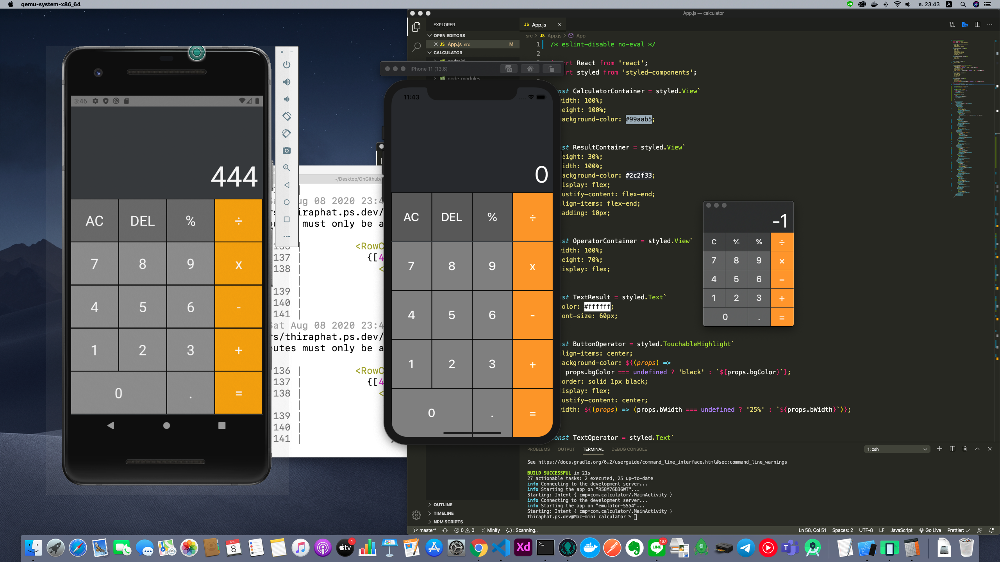

# calculator

Calculator App With ReactNative & styled-components

### Preview



### Installation

[Setting up the development environment](https://reactnative.dev/docs/environment-setup)

Run npm install to install node_module

```bash
$ npm i
```

Run application with command

```bash
$ react-native run-android
# or
$ react-native run-ios
```

##### Enjoy This !
